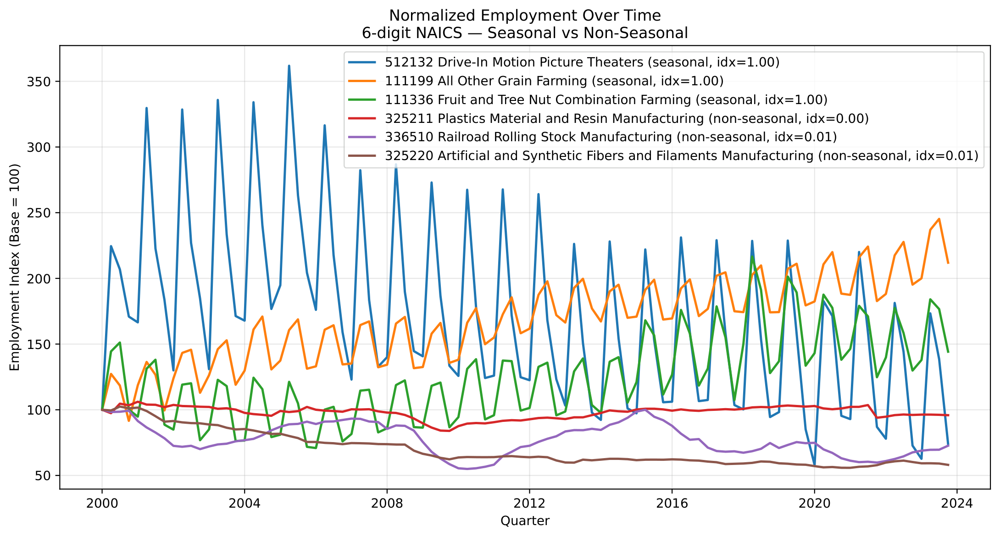
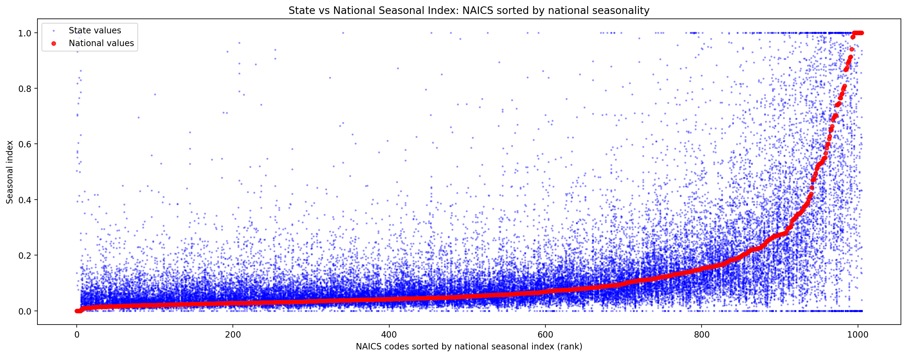
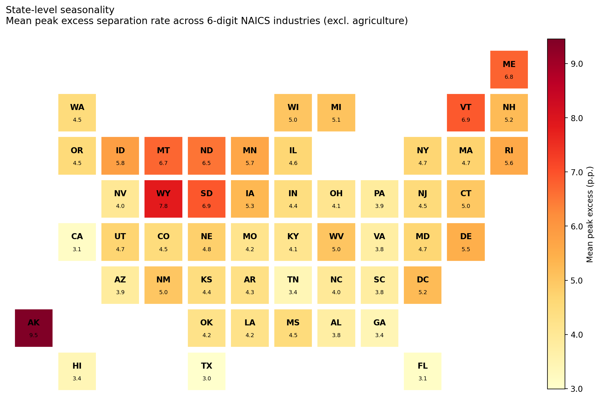
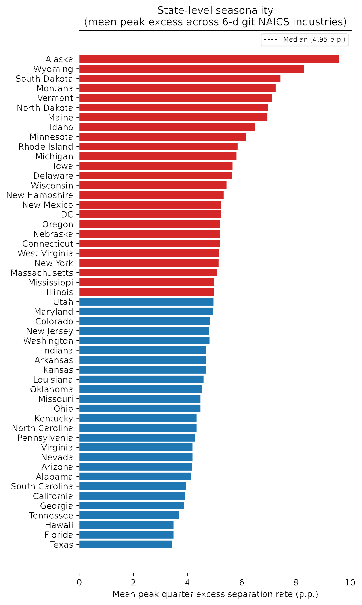

## Motivation: Jobs, Seasonality, and Eviction

- Understanding the interaction between **jobs and eviction risk**

- Consider two workers with the **same annual income**:
  - **Worker A** works in **education** --- a seasonal sector: income drops
    during the summer
  - **Worker B** works in **medicine** --- a non-seasonal sector: steady
    income year-round

- **Question:** is there a difference in eviction risk between these two
  workers?

## What Would This Tell Us?

- **If eviction risk is the same** for both workers --- eviction risk loads
  on *annual* income, not on the seasonality of when it arrives
  - Eviction is fundamentally about housing affordability

- **If eviction risk is higher for the seasonal worker** --- a couple of
  potential explanations:
  - **Cash constraints / liquidity:** even with the same annual income, a
    bad month can trigger missed rent without a buffer
  - **Behavioral:** households may size their housing (rent level,
    quality) to their *monthly* income rather than their *expected annual*
    income

## Step 1: Identifying Seasonal Jobs

**Coglianese & Price (2025):**

$$
\text{Excess Recurrence} = \Pr(\text{sep at }t+12) - \frac{\Pr(\text{sep at }t+11) + \Pr(\text{sep at }t+13)}{2}
$$

- For a worker who separates from employment in month $t$
- Counterfactual = average of adjacent lags (11 and 13 months) $\to$
  isolates the *annual* spike that marks genuinely seasonal separations
- Estimated via event-study OLS on a panel centered around each focal
  separation (CPS and SIPP)

## Applying This to the Public-Use QWI

**Benefits:**

- More detailed industries --- 6-digit NAICS vs. CP's 1-digit
- Longer time series --- 2000--2023 vs. CP's CPS/SIPP sample windows
- State-specific estimates --- CP's approach has no geography

**Drawbacks:**

- **Quarterly, not monthly** --- a coarser measure of timing than CP's
  month-level data
- **Industry aggregates, not individual job losses** --- QWI tells us
  whether an industry is seasonal, not whether a specific worker's job is

## Our Measures of Seasonality

**Quarterly analog of excess recurrence:** for each quarter
$q \in \{1,2,3,4\}$ and industry $j$,

$$
\text{Excess}(q)_{j} = \overline{\text{SepRate}_{j,q,t} - \frac{\text{SepRate}_{j,q-1,t} + \text{SepRate}_{j,q+1,t}}{2}}
$$

(quarters treated cyclically; average over years $t$)

- **ExcessPeak:** $\text{ExcessPeak}_j = \max_q\, \text{Excess}(q)_j$ ---
  the industry's peak-quarter excess separation rate
- **Seasonal index:** $\max_q - \min_q$, normalized to $[0,1]$ --- doesn't
  assume any particular quarter is "the" seasonal quarter
- **Peak quarter:** which quarter drives the seasonality
- We also build a **stock** (employment-level) version as a cross-check;
  results here use the **flow** (separations-based) version

## National Seasonality

| NAICS & description | Seasonal index | Excess recurrence | Peak quarter |
|---|---|---|---|
| 111336 Fruit/tree nut combo farm. | 1.00 | 0.333 | Q4 |
| 722330 Mobile food services | 1.00 | 0.316 | Q3 |
| 111160 Rice farming | 1.00 | 0.563 | Q4 |
| 111199 Other grain farming | 1.00 | 0.398 | Q4 |
| 115113 Crop harvesting (machine) | 1.00 | 0.398 | Q4 |
| 512132 Drive-in motion picture theaters | 1.00 | 0.363 | Q3 |
| 532284 Recreational goods rental | 1.00 | 0.485 | Q3 |

: Most seasonal 6-digit NAICS industries (national)

## Seasonality by Sector

::: {.columns}
::: {.column width="50%"}

| Sector | Seas. idx | Excess rec. | Peak Q |
|---|---|---|---|
| Agriculture, forestry, fishing | 0.504 | 0.157 | Q4 |
| Arts, entertainment & recreation | 0.461 | 0.143 | Q3 |
| Accommodation & food services | 0.345 | 0.103 | Q3 |
| Educational services | 0.272 | 0.084 | Q2 |
| Construction | 0.193 | 0.059 | Q4 |
| Real estate | 0.166 | 0.056 | Q4 |
| Other services | 0.134 | 0.042 | Q3 |
| Professional & technical services | 0.129 | 0.040 | Q4 |
| Retail trade | 0.122 | 0.035 | Q3 |
| Information | 0.119 | 0.039 | Q4 |

:::
::: {.column width="50%"}

| Sector | Seas. idx | Excess rec. | Peak Q |
|---|---|---|---|
| Public administration | 0.117 | 0.038 | Q3 |
| Administrative & waste services | 0.115 | 0.032 | Q4 |
| Transportation & warehousing | 0.110 | 0.035 | Q4 |
| Finance & insurance | 0.101 | 0.033 | Q4 |
| Mining, quarrying, oil & gas | 0.088 | 0.027 | Q4 |
| Health care & social assistance | 0.066 | 0.022 | Q3 |
| Wholesale trade | 0.063 | 0.018 | Q4 |
| Management of companies | 0.061 | 0.021 | Q4 |
| Manufacturing | 0.053 | 0.017 | Q3 |
| Utilities | 0.049 | 0.014 | Q3 |

:::
:::

## What Seasonality Looks Like

{fig-align="center" height="500"}

- Employment normalized to 100 in each industry's first quarter
- Seasonal industries (blue/orange/green) swing 20--40% above and below
  trend every year; non-seasonal industries (red/purple/brown) barely move
  quarter to quarter

## State-Specific Seasonality

- Suppression is much more binding at the state $\times$ 6-digit level
  than nationally --- of 51 states $\times$ 1,011 industries
  (51,561 possible cells), **42,344 (82.1%)** clear a 5-year minimum
  coverage threshold
- **Cascade** for each state $\times$ industry estimate:
  1. State $\times$ 6-digit NAICS, if populated
  2. State $\times$ 4-digit NAICS, if the 6-digit cell isn't
  3. National 6-digit NAICS, as the final fallback

## How Much More Do State Estimates Capture?

{fig-align="center" height="500"}

- Industries (x-axis) sorted by their **national** seasonal index (red)
- **State-level** values for the same industries (blue) scatter widely
  above and below the national figure --- a lot of real seasonality is
  averaged away by the national index alone

## Most and Least Seasonal States

{fig-align="center" height="550"}

## Most and Least Seasonal States, Ranked

{fig-align="center" height="500"}

- **2.8$\times$ gap** between the most seasonal (Alaska, 9.6 p.p.) and
  least seasonal (Texas, 3.4 p.p.) states
- Northern/Great Plains states consistently more seasonal; Sun Belt
  states consistently less so
- **Caveat:** per-state QWI coverage years are uneven --- 40 of 51 states
  span the full 2000--2023 window, but 11 have partial coverage.
  **Alaska only has data through 2016** (missing 2017--2023); Massachusetts
  only starts in 2010

## Where This Goes Next

- This has all been a **proof of concept**, using **public-use** QWI data
- We now have a **shareable file of seasonal indexes** (national and
  state $\times$ NAICS6, with a codebook) usable for other exercises, e.g.:
  - **Is my county seasonal?** (weighting by local industry mix from CBP)
  - **Has seasonality changed over time?**

- **But we can do more with the internal LEHD:**
  - Monthly, not quarterly, timing
  - Individual job losses, not industry aggregates
  - A direct link to worker- and household-level outcomes --- including
    eviction
