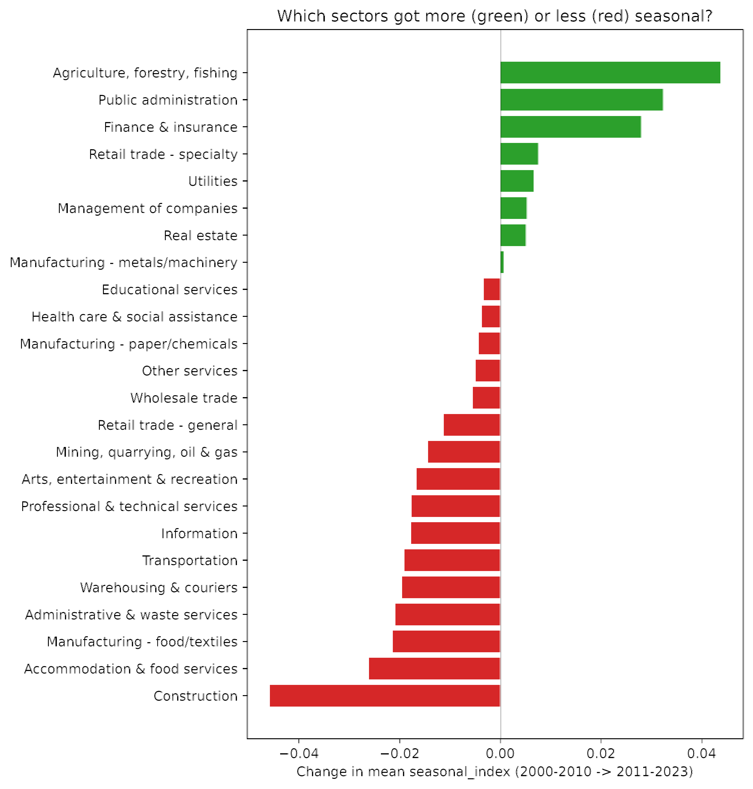
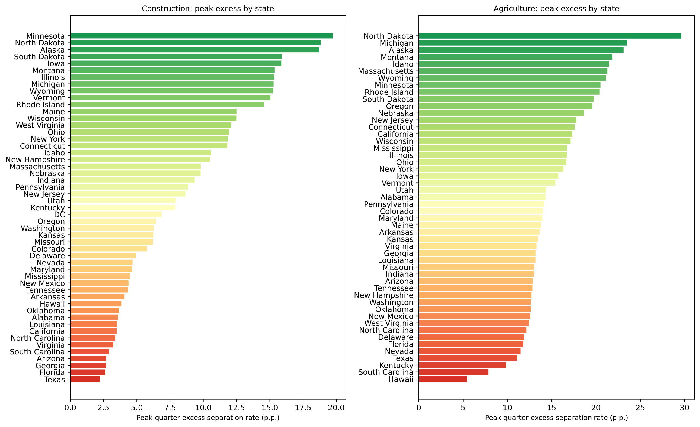
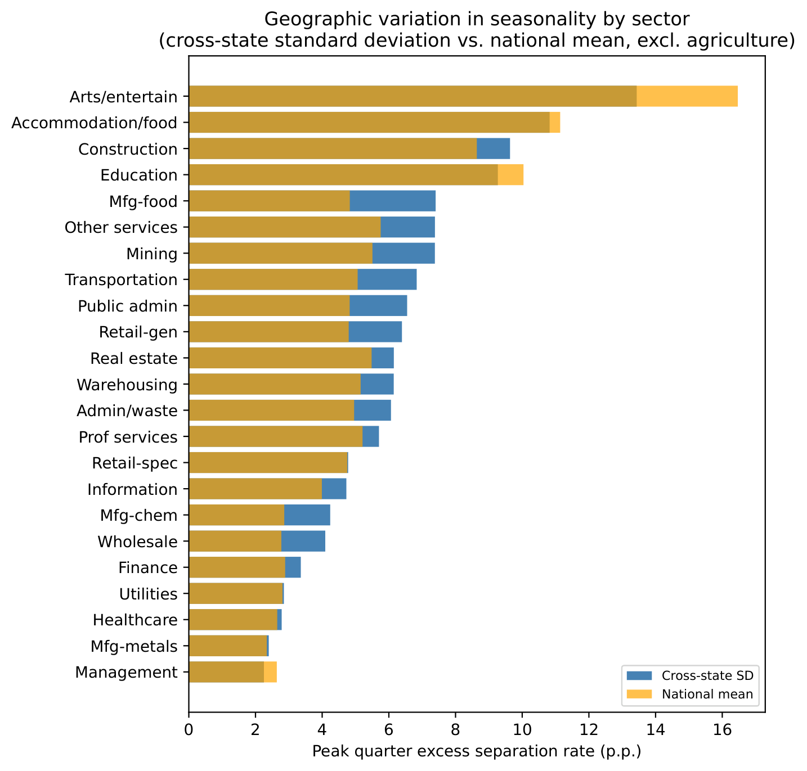
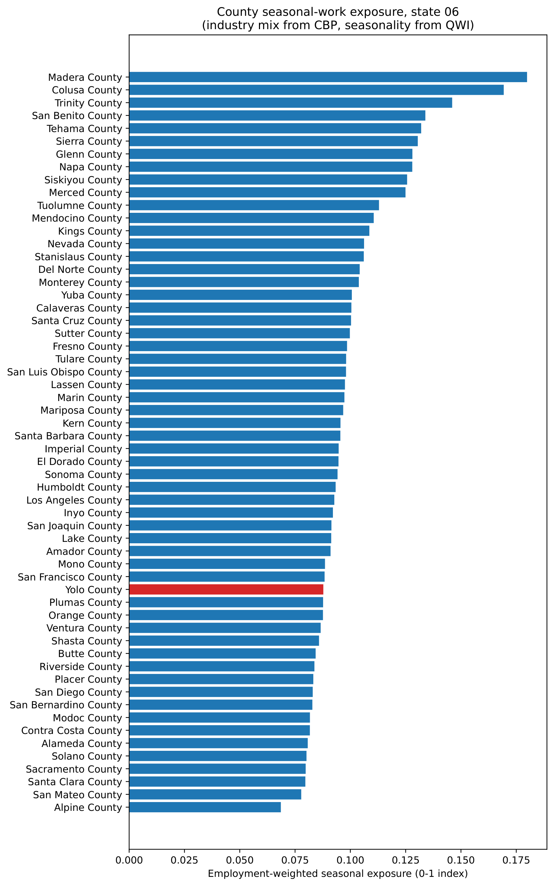
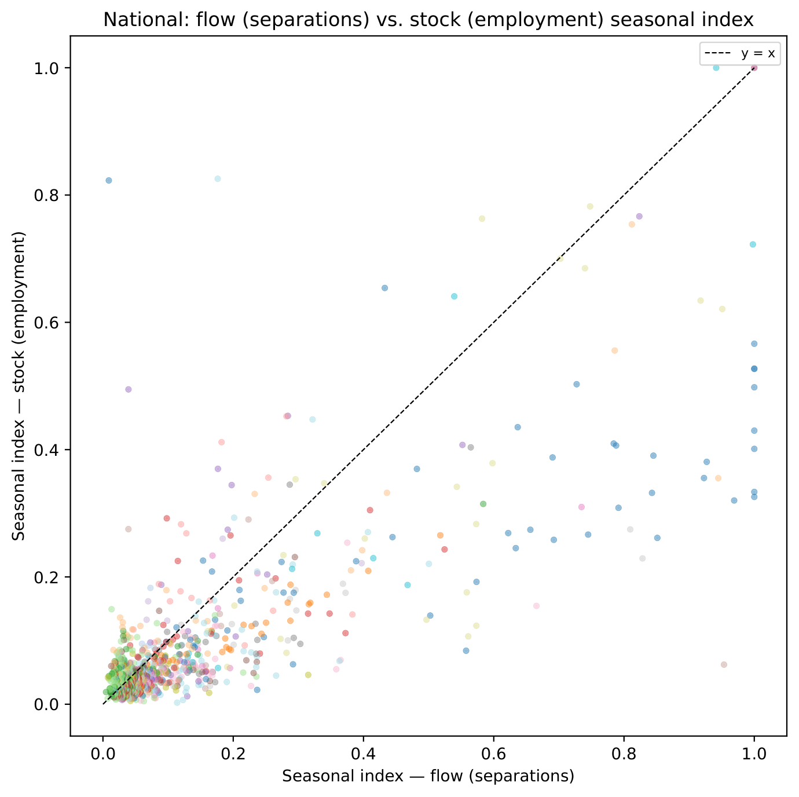
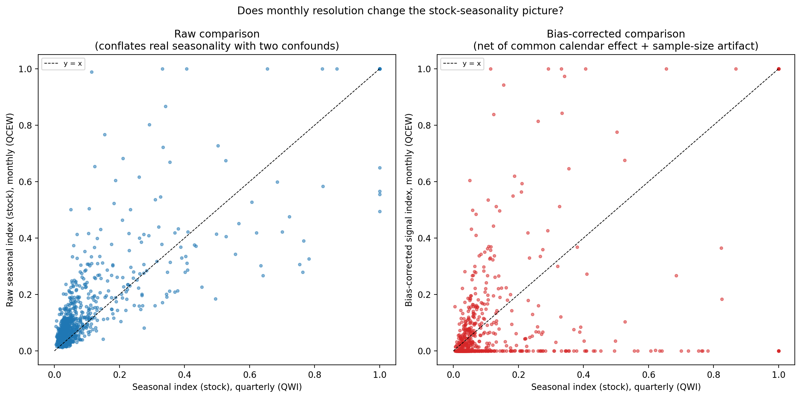
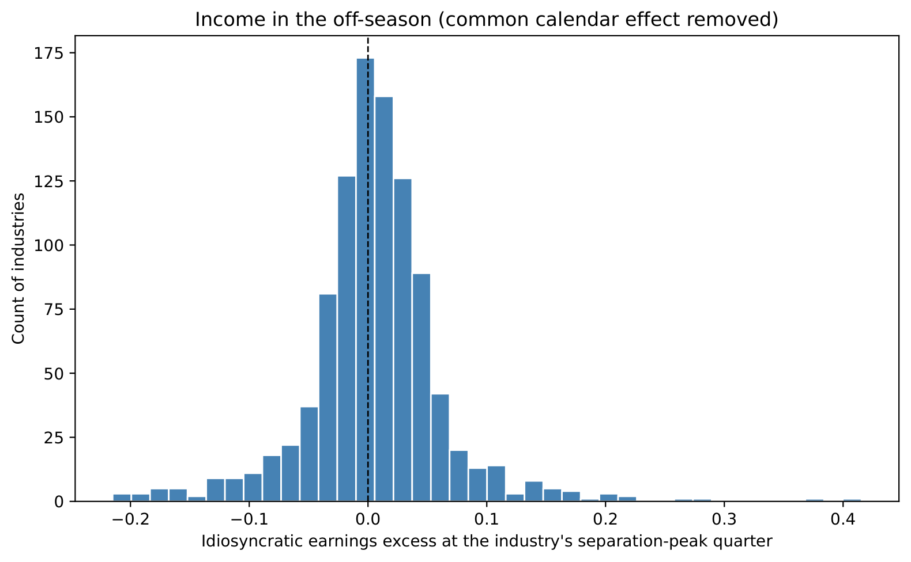

# Replication of Coglianese & Price (2025)

## Coglianese & Price (2025): Overview

- "Income in the Off-Season: Household Adaptation to Yearly Work
  Interruptions," *ILRR* 2025
- **Question:** How do households smooth income when employment separations
  recur annually (i.e. are *seasonal*)?
- **Key innovation:** Identify seasonal separations from administrative data
  without requiring industry or occupation labels

- Core estimand: **excess recurrence** at 12-month horizon

$$
\widehat{\text{ExR}} = \Pr(\text{sep at }k{=}12) - \frac{\Pr(\text{sep at }k{=}11) + \Pr(\text{sep at }k{=}13)}{2}
$$

- Counterfactual = average of adjacent lags $\to$ isolates the *annual
  spike* marking genuine seasonal separations

## Estimation Strategy

**Event-study OLS on separators panel (CPS and SIPP):**

$$
\mathbf{1}[\text{sep at }k] = \sum_{j} \beta_j \mathbf{1}[k=j] + \varepsilon
$$

- Estimate by OLS; excess recurrence = $\beta_{12} - (\beta_{11}+\beta_{13})/2$
- Standard error via delta method

**Two specifications:**

1. *Raw* (Figure 2 in paper): only horizon dummies, no constant
2. *Preferred* (Appendix F.1): adds controls for interview-seam artifacts
   (SIPP) and weeks elapsed since separation (CPS)

- Python replication uses `statsmodels` WLS with clustered SEs; data from
  the LEHD-style pre-cleaned `.dta.gz` files in the replication package

## Replication Results

| Specification | Where | Paper | Replication |
|---|---|---|---|
| CPS raw (Figure 2) | Figure 2 | 1.4 p.p. (SE 0.14) | 1.44 ✓ |
| CPS preferred | App. F.1 | 1.5 p.p. (SE 0.14) | 1.42 ✓ |
| SIPP raw (Figure 2) | Figure 2 | 2.0 p.p. (SE 0.11) | 2.04 ✓ |
| SIPP preferred | App. F.1 | 1.6 p.p. (SE 0.11) | 1.62 ✓ |

: Excess recurrence estimates: paper vs. Python replication

- All four estimates within rounding of published values
- Industry ranking: **Agriculture, Education, and Entertainment** are the
  top three by excess recurrence in *both* CPS and SIPP (order varies
  slightly by dataset)
- **Healthcare** is near the bottom in both; **Construction** is solidly
  mid-pack (8th/15 CPS, 7th/15 SIPP) --- not top-tier, despite common
  intuition. (Mining flips sign across datasets on a small sample and is
  excluded from ranking claims.)

# QWI 6-Digit NAICS Seasonal Index

## Extending to 6-Digit NAICS via QWI

- CP's classifier operates at the worker level; industry rankings are
  reported at 1-digit NAICS only
- **Goal:** produce a finer, industry-level seasonal index suitable for
  firm classification

- **Data:** Census Quarterly Workforce Indicators (QWI)
  - Quarterly separations and employment by state $\times$ 6-digit NAICS
  - 51 states + DC, years 2000--2023 (1,011 industries)

- **Quarterly analog to excess recurrence:** for each quarter
  $q \in \{1,2,3,4\}$ and industry $j$,

$$
\text{Excess}(q)_{j} = \overline{\text{SepRate}_{j,q,t} - \frac{\text{SepRate}_{j,q-1,t} + \text{SepRate}_{j,q+1,t}}{2}}
$$

(quarters treated cyclically; average over years $t$)

- **Peak excess:** $\text{ExcessPeak}_{j} = \max_q\, \text{Excess}(q)_j$
- **Seasonal amplitude:** $\max_q - \min_q$ normalised to $[0,1]$; does not
  assume any particular quarter is "the" seasonal quarter

## National Seasonal Index: Top Industries

::: {.columns}
::: {.column width="58%"}

| NAICS & description | ExcessPeak | $n$ |
|---|---|---|
| 512132 Drive-in motion picture theaters | 0.363 | 21 |
| 532284 Recreational goods rental | 0.485 | 22 |
| 722330 Mobile food services | 0.316 | 18 |
| 525120 Health and welfare funds | 0.310 | 21 |
| 713990 Other amusement/recreation | 0.325 | 24 |
| 311313 Beet sugar manufacturing | 0.335 | 23 |
| 721211 RV parks and campgrounds | 0.252 | 23 |
| 711212 Racetracks | 0.238 | 23 |
| 611710 Educational support services | 0.239 | 17 |
| 487210 Scenic/sightseeing water transport. | 0.269 | 23 |
| 312113 Ice manufacturing | 0.292 | 24 |
| 611620 Sports/recreation instruction | 0.310 | 24 |

: Top 12 most seasonal 6-digit NAICS industries (national, excl. agriculture)

:::
::: {.column width="40%"}

- **Excludes agriculture** (NAICS 11) --- QWI's UI-based coverage of
  agricultural employment is historically weaker/partial, so it may look
  more seasonal here than it truly is (see sensitivity check)
- $n$ = years contributing to ExcessPeak estimate; a $\geq 5$-year minimum
  is enforced so thin, disclosure-suppressed cells can't masquerade as
  extreme seasonality
- Entries are intuitive once named: mobile food services (food trucks),
  drive-in theaters, ice manufacturing (summer demand), beet sugar
  manufacturing (harvest season)
- Seasonal index normalized to [0,1] via 99th-pct winsorization ---
  raw amplitude is right-skewed, so dividing by the true max would
  compress everyone else near 0; cost is that the top industries tie
  at exactly 1.00
- Correlation with CP 1-digit rankings: $\rho = 0.829$

:::
:::

## National Seasonal Index: Sector Summary

| Sector | Mean seasonal index | ExcessPeak (p.p.) |
|---|---|---|
| Arts, entertainment & recreation | 0.551 | 14.3 |
| Accommodation & food services | 0.395 | 10.3 |
| Educational services | 0.332 | 8.4 |
| Construction | 0.236 | 5.9 |
| Real estate | 0.193 | 5.6 |
| Other services | 0.163 | 4.2 |
| Retail trade | 0.149 | 3.5 |
| Transportation & warehousing | 0.134 | 3.5 |
| Health care & social assistance | 0.081 | 2.2 |
| Wholesale trade | 0.077 | 1.8 |
| Manufacturing | 0.065 | 1.7 |

: Mean seasonal index by 2-digit sector (national, excl. agriculture)

Excludes agriculture (see sensitivity check) --- if included, it would
rank #1 (0.504). Education peaks in Q2 (end of school year), not Q4 ---
ExcessPeak is positive across all sectors. CP's 1-digit rankings confirmed
at finer granularity.

## Robustness Check: Does COVID Distort the Index?

- The national index pools 2000--2023. Mass pandemic-era layoffs in
  industries already ranked highly seasonal (accommodation/food, arts &
  entertainment) could inflate "excess separation" for reasons that have
  nothing to do with normal annual seasonality
- **Test:** recompute the index restricted to 2000--2019 only, compare to
  the full sample

**Result: rankings are robust.**

- Pearson correlation (full vs. pre-COVID seasonal index): 0.997
- Spearman rank correlation: 0.986
- Only 6.7% of industries have a different peak quarter
- Watch sectors (agriculture, construction, education, arts/entertainment,
  accommodation/food) all shift by $\leq 0.017$

- **One genuine mover:** a transportation industry (transit, NAICS 485111)
  whose index is roughly 4.7$\times$ higher with COVID years included ---
  plausibly a real ridership-collapse effect, not a data artifact

# Has Seasonality Changed Over Time?

## Seasonality Over Time: 2000--2010 vs. 2011--2023

- The national index pools all 24 years. Has seasonality actually been
  stable, or has it drifted over two decades?
- **Test:** split the sample in two and recompute independently. The
  5-year `n_excess_obs` minimum is what makes a clean two-way split
  possible --- both halves (11 and 13 years) keep near-full coverage, so a
  three- or four-way split isn't advisable

**Result: correlated, with real drift.**

- Pearson $r = 0.931$, Spearman $r = 0.826$ (both notably lower than the
  COVID check's 0.997/0.986 --- an 11-year gap between period midpoints is
  a much bigger ask than excluding 2 years)
- Economy-wide mean seasonal index is essentially flat: $0.131 \to 0.122$

- **But the flat average hides a real reshuffling** beneath it (next slide)
- 30.2% of industries have a different peak quarter, but this concentrates
  in weakly-seasonal industries (43% of the bottom quartile vs. 15% of the
  top) --- ordinary noise, not genuine timing instability among strongly
  seasonal industries

## Which Sectors Got More or Less Seasonal?

::: {.columns}
::: {.column width="58%"}

:::
::: {.column width="40%"}

**Educational services: largest decline**

- $-0.053$, the biggest sector decrease (0.272 $\to$ 0.219)

**Construction: also declining**

- $-0.047$ (0.216 $\to$ 0.169)

**Agriculture: modest decline**

- $-0.037$ (0.504 $\to$ 0.466)

**Finance/insurance and public admin: rose most**

- $+0.028$ and $+0.032$ respectively --- the only two sectors with a
  meaningful increase

:::
:::

# Geographic Variation

## Geographic Variation: Overview

- The national index masks substantial state-level heterogeneity
- We compute ExcessPeak for each state $\times$ 6-digit NAICS cell (42,344
  cells with $\geq 5$ year-observations); **excludes agriculture**
  throughout (see sensitivity check)

- **Main finding:** a 3.2$\times$ gap between most and least seasonal
  states in mean peak excess (Alaska: 9.5 p.p. vs. Texas: 3.0 p.p.)
- Northern/Great Plains states consistently more seasonal across multiple
  sectors; Sun Belt states consistently less so

**Most geographically variable sectors:**

1. Arts & entertainment (cross-state SD = 13.4 p.p.)
2. Accommodation/food (SD = 10.8 p.p.)
3. Construction (SD = 9.6 p.p.)
4. Educational services (SD = 9.3 p.p.)

- **Least geographically variable:** management of companies, metals
  manufacturing, healthcare --- consistent low seasonality everywhere

- **Caveat:** per-state QWI coverage years are uneven --- 40 of 51 states
  span the full 2000--2023 window, but 11 have partial coverage.
  **Alaska, the most seasonal state above, only has data through 2016**
  (missing 2017--2023); Massachusetts only starts in 2010.

## State-Level Mean Seasonality

## Construction and Agriculture by State

Agriculture panel shown for context only (excluded from headline figures
above --- see sensitivity check).
**Construction:** Minnesota (19.7 p.p.) vs. Florida (2.6 p.p.) --- an
8$\times$ gap driven by winter construction shutdowns in northern states.
**Agriculture:** North Dakota (29.6 p.p.) leads, ahead of Michigan (23.5
p.p.), Alaska (23.1 p.p.), Montana, and Idaho.

## Robustness Check: Does Excluding Agriculture Matter?

- **Motivation:** QWI/LEHD UI wage-record coverage for agricultural
  employment is historically weaker/partial relative to other industries
  (state-level UI exemptions for small ag employers; later coverage
  extension in several states) --- so agriculture's QWI-covered
  establishments may be a non-representative (more seasonal) slice of the
  true agricultural workforce
- **Test:** recompute the sector and state rankings excluding NAICS
  sector 11 (crop production, animal production, forestry/logging,
  fishing/hunting, and support activities for agriculture)

**Result: sector ranking reshuffles; state ranking barely moves.**

- Sector level: Agriculture (0.504) drops out; Arts & entertainment
  becomes the new #1 (0.461 $\to$ 0.551 after re-winsorization); the
  top-12 individual-industries list changes completely
- State level: full-sample vs. excluding-agriculture rankings correlate
  at Pearson $r=0.991$, Spearman $r=0.989$ --- **Alaska stays most
  seasonal** (9.58 $\to$ 9.45 p.p.) and **Texas stays least seasonal**
  (3.43 $\to$ 2.99 p.p.) either way

**Interpretation:** Alaska's high seasonality is driven mainly by
*non-agricultural* seasonal industries (plausibly tourism/fishing-adjacent
services), not farming --- the geographic story does not rest on
agriculture's contested UI coverage, so the headline figures in this deck
exclude it as the more defensible choice.

## State-Specific Top and Bottom 1% Industries

::: {.columns}
::: {.column width="52%"}

| Statistic | Top 1% | Bottom 1% |
|---|---|---|
| State-industry slots | 413 | 413 |
| Unique NAICS6 codes | 137 | 253 |
| Codes appearing once | 59 | 156 |
| Codes in 10+ states | 7 | 0 |
| Pairwise Jaccard | 0.053 | 0.014 |
| Also national same tail | 11.4% | 1.9% |

: Within-state NAICS6 tails

Interpretation: the state-specific tails are related to the national
index, but most state-tail industries are not simply the national top or
bottom 1% repeated everywhere.

:::
::: {.column width="46%"}

**Recurring top-1% industries**

- Nursery/tree production: 15 states
- Marinas: 14 states
- Specialty trade contractors: 12 states
- Golf courses/country clubs: 11 states
- Miscellaneous crop farming: 11 states

**Bottom-1% pattern**

- More diffuse than the top tail
- Concentrated in metals manufacturing, wholesale, chemicals, finance, and
  transportation

:::
:::

## Geographic Variation: Sector Cross-State SD

# County-Level Exposure (California Pilot)

## County-Level Seasonal Exposure: Methodology

- **Goal:** how seasonal is the average job in a given county, given the
  industries actually located there?

$$
\text{Exposure}_c = \frac{\sum_j \text{EMP}_{c,j} \times \text{seasonal\_index}_j}{\sum_j \text{EMP}_{c,j}}
$$

- **Data:** County Business Patterns (CBP) establishment/employment counts
  by county $\times$ NAICS, merged onto the state $\times$ NAICS6 seasonal
  index

- **Problem:** CBP suppresses most county $\times$ NAICS6 cells
  (disclosure avoidance) --- a county's genuinely seasonal niche
  industries are often exactly the small, easily-identified cells that get
  suppressed
- **Fix: three-tier fallback** for each industry's seasonal score: (1)
  state $\times$ NAICS6, (2) national NAICS6, (3) national NAICS4 (also
  recovers employment CBP suppresses at 6-digit but still reports at
  4-digit)
- $\to$ California pilot: **100% employment coverage** in all 58 counties
  --- no county's score rests on a partial industry match

## California County Ranking

## Case Study: Yolo County

- **Yolo County ranks 41st of 58** California counties (30th percentile)
  --- *less* exposed to seasonal work than roughly two-thirds of the
  state, despite being an agricultural county

- **Why:** employment-weighting means large, stable service/logistics
  employers dominate the score:
  - Limited-service restaurants (3,222 jobs, index 0.10), general
    warehousing (3,087 jobs, index 0.06), couriers (1,731 jobs, index
    0.14) --- all low-seasonality but large employers
  - Crop harvesting scores the *maximum* 1.00 --- but employs only 246
    people locally

- **Context:** Central Valley farm counties top the ranking (Madera 0.180,
  Colusa 0.169 --- roughly 2$\times$ Yolo's 0.088); the rest of the
  Sacramento metro area (Sacramento, Solano, Placer) clusters near Yolo at
  the low-seasonality end
- $\to$ A county can have extreme seasonal niches and still score low
  overall, if its broader economy has diversified around them

# Flow vs. Stock: Two Views of Seasonality

## Flow vs. Stock: Motivation

- The index is built two ways in parallel:
  - **Flow** (`seasonal_index`): from separation *rates* --- does a
    quarter see an excess of separations?
  - **Stock** (`seasonal_index_emp`): from employment *levels* normalized
    to their own annual mean --- does headcount itself swell or shrink
    that quarter?

**Result: correlated.**

- National ($n=997$): Pearson $r = 0.784$, Spearman $r = 0.660$
- State $\times$ NAICS6 ($n=39{,}446$): Pearson $r = 0.750$, Spearman
  $r = 0.661$
- **Peak-quarter concordance is low --- $\sim$15% nationally, $\sim$13% by
  state**: even when both measures agree an industry is seasonal, they
  usually disagree on *which quarter* drives it

- $\to$ Timing, not just amplitude, differs between "separations spike"
  and "headcount swings" (see next slide)

## Flow vs. Stock: Sector Heterogeneity

::: {.columns}
::: {.column width="55%"}

:::
::: {.column width="42%"}

**Construction: near-perfect agreement**

- Flow/stock correlation $r = 0.97$ ($n=31$): winter layoffs = winter
  headcount drop

**Agriculture: weaker, not decoupled**

- $r = 0.64$ ($n=55$) --- meaningfully positive, though less tightly
  linked than Construction

**"Stock without flow" examples**

- Cotton Ginning (flow 0.01, stock 0.82) pairs with Political
  Organizations (flow 0.18, stock 0.83) --- hiring surges (harvest;
  elections) without a matching separation spike

:::
:::

# Monthly Resolution via QCEW

## Does Quarterly Averaging Hide Seasonality?

- **Motivation:** QWI is quarterly --- a coarser measure of timing than
  CP's month-level analysis. BLS's QCEW reports true monthly employment
  (`month1_emplvl`/`month2_emplvl`/`month3_emplvl`); does resolution
  actually matter?
- **Scope limit:** QCEW has no separations/hires field at all --- it can
  only sharpen the **stock** measure (`seasonal_index_emp`) from
  quarterly to monthly, not the flow (separations) measure
- Same shared cyclical-excess calculation as every other measure in this
  project, generalized from 4 periods to 12
  (`excess_utils.cyclical_excess_by_month()`)

**Two confounds corrected before trusting any comparison:**

1. **Common calendar effect** --- 47.4% of industries raw-peak in
   December (vs. $\sim$8.3% if spread evenly across 12 months): a broad,
   non-seasonally-adjusted economy-wide pattern, the same phenomenon
   already found for earnings (Q4 bonus effect, see below)
2. **Sample-size artifact** --- max$-$min range over 12 monthly draws is
   *mechanically* larger than over 4 quarterly draws even with zero true
   seasonality. A permutation test (shuffle month labels within each
   year, recompute) confirms: placebo (null) amplitude is **89.7%** of
   the idiosyncratic amplitude on average

## Monthly Resolution: Result

::: {.columns}
::: {.column width="55%"}

:::
::: {.column width="42%"}

**Correlation drops sharply once corrected**

- Raw: Pearson $r=0.788$, Spearman $r=0.748$
- Bias-corrected (`signal_index`): Pearson $r=0.444$, Spearman $r=0.398$
- Peak-quarter concordance only 38.3%
- 48.4% of industries show **zero** genuine monthly-specific signal

**Real winner:** School and Employee Bus Transportation --- signal index
**1.00** vs. quarterly stock index **0.11**. September's abrupt school-year
start is averaged away with a quiet summer in the same quarter.

**False signals, corrected to zero:** Skiing Facilities, RV Parks, Golf
Courses --- genuinely seasonal, but at a quarterly-or-longer scale QWI
already captures well.

:::
:::

# Income/Earnings Seasonality

## A Third Lens: Does Income Dip in the Off-Season?

- Flow and stock both measure separations/headcount. A third QWI measure,
  `EarnBeg` (average monthly earnings), tests the paper's title question
  directly: **does income dip in an industry's own off-season?**
- *Data note:* the originally-requested `Payroll` field returns `null`
  from the Census API for every cell tested (even huge industries where
  employment populates fine); `EarnBeg` is the working substitute

- **A confound has to be fixed first:** 83% of *all* 1,011 industries ---
  not just seasonal ones --- have their raw earnings index peak in Q4.
  That's a broad, economy-wide year-end bonus/holiday-pay effect, not
  industry-specific timing
- Left uncorrected, this swamps the signal: whether an industry's *own*
  separation-peak quarter happens to land in Q4 (everyone's bonus quarter)
  almost entirely determines whether it looks like income "dips" there
- $\to$ **Fix:** compute the common cross-industry calendar effect (Q1
  $-0.031$, Q2 $-0.005$, Q3 $-0.048$, Q4 $+0.085$) and net it out before
  testing --- the *idiosyncratic* index isolates industry-specific timing

## Does Income Dip in the Off-Season? The Answer

::: {.columns}
::: {.column width="55%"}

:::
::: {.column width="42%"}

**Naive test: 52.3% "dip"** --- but almost entirely mechanical:

- Only 8.3% dip when the separation peak falls in Q4 (everyone's earnings
  peak)
- 93.6% "dip" when it falls in Q3 (rarely anyone's earnings peak)

**De-confounded (credible) test:**

- **44.2% dip**, mean excess $+0.0055$ --- essentially flat, not clearly
  negative
- No strong evidence of industry-average income dipping in the off-season

**Construction: the sharp counter-example**

- Dip rate only 3.2%, mean excess $+0.044$ --- earnings *higher*,
  plausibly overtime pay before winter layoffs

*Doesn't contradict CP: their effect is the separating worker's own income
loss (micro); this tests the industry-wide average (macro) --- a
different, complementary question.*

:::
:::

# Pay, Gender, and Rent Burden

## Same Pay, Opposite Seasonality: Does It Matter?

- **Question:** among female-dominated industries, does seasonal work
  leave otherwise-comparable workers more rent-burdened?

- **Pay:** ACS PUMS `WAGP` --- wage/salary income a person *actually
  received* in the past 12 months, not a QWI pay *rate* annualized
  $\times 12$. This matters specifically for seasonal work: someone who
  doesn't work all four quarters reports their true (lower) realized
  income, not a year-round-equivalent rate
- **Gender & pay & seasonality, one resolution:** ACS/CPS survey data
  classifies industries more coarsely than 6-digit NAICS (e.g. Educational
  Support Services is grouped with five sibling "other schools and
  instruction" codes). Pay, %female, and QWI seasonality (aggregated up
  from NAICS6, employment-weighted) are all computed at that same
  resolution, so the three are directly comparable
- **Rent benchmark:** Census ACS national median gross rent, \$1,413/month

- **Screen:** female-dominated ($\geq 55\%$), within 15% on pay,
  seasonal-index gap $\geq 0.25$ --- only 9 of 250 industry codes clear
  the female-share and sample-size bars

## Matched Pairs: Same Pay, Opposite Seasonality

| Industry (Census industry code) | Seasonal idx. | Pay | Rent burden |
|---|---|---|---|
| Ed. support & other schools (peak Q2) | 0.51 | \$20,000 | 84.8% |
| Other personal services (flat) | 0.13 | \$20,000 | 84.8% |
| Civic/social/advocacy orgs (peak Q3) | 0.43 | \$50,000 | 33.9% |
| Outpatient care centers (flat) | 0.04 | \$48,000 | 35.3% |
| Civic/social/advocacy orgs (peak Q3) | 0.43 | \$50,000 | 33.9% |
| Other health care services (flat) | 0.06 | \$50,000 | 33.9% |

: Same-pay pairs, one seasonal and one flat (both female-dominated)

- **Top pair:** both sides *exactly* \$20,000 realized median pay,
  65%/68% female --- both **84.8% rent-burdened**
- $\to$ **Weeks worked doesn't explain the pay level:** every pair differs
  by $<$1 week/year ($\sim$46--49 either way). The pay gap tracks each
  industry's wage level, not annual weeks logged --- closer to CP's
  household-adaptation story (workers find other work around a seasonal
  separation) than "seasonal $\to$ fewer weeks"
- **Caveat:** `WAGP` is a personal wage --- many \$20,000 earners are
  secondary earners or part-time, not sole rent-payers

# Discussion

## Implications for Firm Classification

- The QWI index enables firm-level seasonal classification via NAICS
  lookup
- The top/bottom 1% analysis shows the exact NAICS6 tails differ sharply
  across states: top tail has 137 unique codes; bottom tail has 253
- **But:** for geographically sensitive sectors (construction,
  agriculture), a single national index may misclassify:
  - A Minnesota construction firm is highly seasonal
  - A Florida construction firm is nearly non-seasonal

**Preferred approach for firm classification:**

1. Use the *state $\times$ NAICS* ExcessPeak as the lookup value when
   state of operation is known
2. Fall back to national index for industries with thin state-level
   coverage (low `n_excess_obs`)
3. Direct estimation from UI wage records when sufficient separations are
   available ($n \geq 20$ per firm)

- **Which index?** Flow suits *turnover risk*; stock suits
  *headcount/staffing swings* --- correlated ($r \approx 0.78$) but timing
  (peak quarter) still agrees only $\sim$15% of the time
- **Caveat:** 6-digit cells are often suppressed in small states;
  state-level estimates for niche agriculture sub-industries may rest on
  very few year-observations

## Summary

1. **Replication:** Python replication of CP (2025) excess recurrence
   matches all four published estimates within rounding
2. **National index:** QWI-based ExcessPeak at 6-digit NAICS correlates
   strongly with CP's 1-digit rankings ($\rho = 0.829$); robust to
   excluding 2020--2021 (Pearson $0.997$). Economy-wide seasonality is
   roughly flat 2000--10 to 2011--23, but Educational services fell most
   ($-0.053$), Construction also fell ($-0.047$), and Agriculture fell
   modestly ($-0.037$); Finance/insurance and public admin rose most
   ($+0.028$, $+0.032$)
3. **Geographic variation:** large state heterogeneity (2.8$\times$ gap,
   Alaska vs. Texas); a California county-level pilot applies the same
   logic down to counties --- Yolo County ranks 41st of 58 CA counties,
   less seasonal than most despite its agricultural economy
4. **Flow vs. stock:** separations-based and employment-based seasonality
   are correlated ($r \approx 0.78$ national) but timing concordance is
   low ($\sim$15%); Construction near-identical ($r=0.97$), Agriculture
   moderate ($r=0.64$)
5. **Income/earnings:** a third lens (`EarnBeg`) finds no strong evidence
   of industry-average income dipping in the off-season once a common
   Q4-bonus effect is removed; Construction again the outlier (earnings
   *higher*, not lower)
6. **Pay, gender, and rent burden:** matching female-dominated industries
   on realized annual pay (ACS PUMS), the most seasonal vs. flattest pair
   --- both at exactly \$20,000/year, 65--68% female --- are *equally*
   rent-burdened (84.8% each) at the national median rent; weeks worked is
   nearly identical across every matched pair, so the pay level tracks the
   industry, not seasonality itself
7. **Next steps:** national CBP rollout for a full county-level index;
   apply the state $\times$ NAICS index to UI wage records for firm-level
   classification
